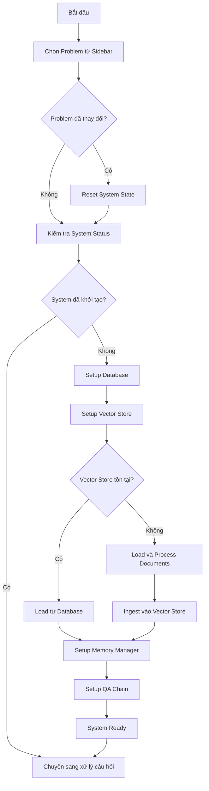
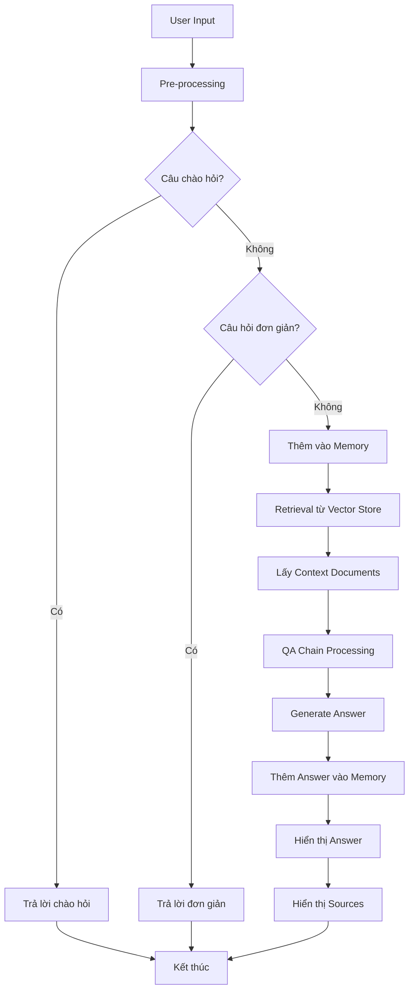
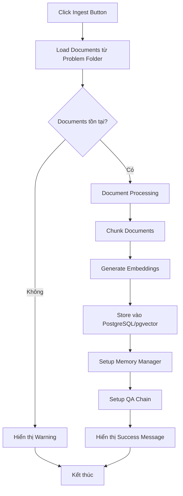
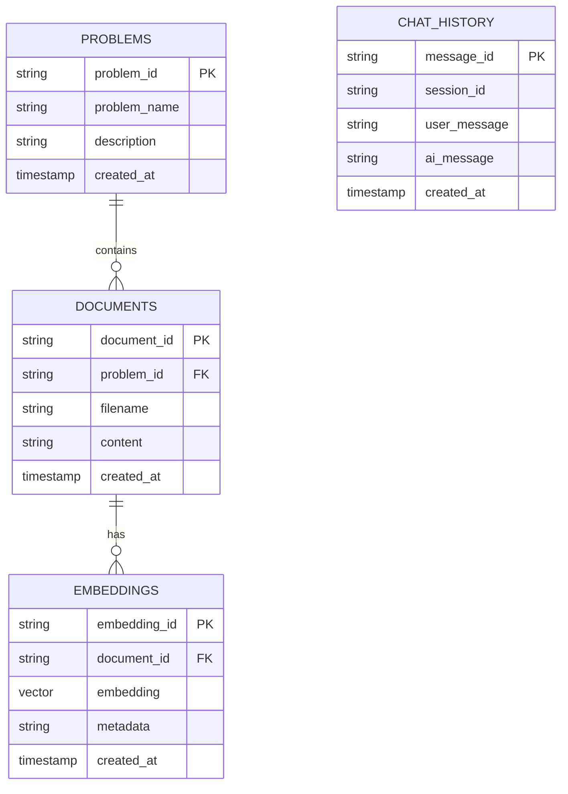
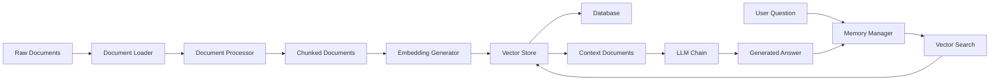

# Luồng Xử Lý Chatbot RAG

Tài liệu này mô tả logic chính của hệ thống chatbot sử dụng RAG (Retrieval-Augmented Generation) để hỗ trợ học tập.

## Tổng Quan Hệ Thống

Hệ thống chatbot RAG được thiết kế để trả lời câu hỏi dựa trên tài liệu bài giảng được lưu trữ trong cơ sở dữ liệu vector. Hệ thống sử dụng kiến trúc modular với các thành phần chính:

- **Database Layer**: PostgreSQL với pgvector để lưu trữ embeddings
- **Vector Store**: Quản lý và tìm kiếm tài liệu tương tự
- **LLM Chain**: Xử lý câu hỏi và tạo câu trả lời
- **Memory Manager**: Lưu trữ lịch sử hội thoại
- **Document Processor**: Xử lý và chunking tài liệu

## Luồng Khởi Tạo Hệ Thống

## Luồng Xử Lý Câu Hỏi

## Luồng Ingest Tài Liệu

## Kiến Trúc Database

## Các Thành Phần Chính

### 1. Database Manager
- Quản lý kết nối PostgreSQL
- Đảm bảo schema pgvector được tạo
- Xử lý các thao tác CRUD cơ bản

### 2. Vector Store Manager
- Quản lý embeddings sử dụng HuggingFace
- Tạo và quản lý collections trong pgvector
- Thực hiện similarity search

### 3. LLM Chain Builder
- Tạo ConversationalRetrievalChain với Gemini
- Quản lý prompt templates
- Tích hợp memory vào chain

### 4. Memory Manager
- Lưu trữ lịch sử hội thoại
- Quản lý context window
- Hỗ trợ nhiều loại memory (buffer, window)

### 5. Document Processor
- Load tài liệu từ filesystem
- Chunk documents thành các đoạn nhỏ
- Xử lý metadata

## Luồng Dữ Liệu

## Xử Lý Lỗi và Fallback

Hệ thống có các cơ chế xử lý lỗi:

1. **Database Connection**: Fallback sang local SQLite nếu PostgreSQL không khả dụng
2. **LLM API**: Hiển thị thông báo lỗi nếu Gemini API không hoạt động
3. **Document Loading**: Warning khi không tìm thấy tài liệu
4. **Vector Store**: Tự động tạo collection mới nếu chưa tồn tại

## Tối Ưu Hóa Hiệu Suất

- **Singleton Pattern**: Sử dụng cho EmbeddingManager và VectorStoreManager
- **Connection Pooling**: Tái sử dụng database connections
- **Memory Management**: Giới hạn context window để tránh memory overflow
- **Caching**: Cache embeddings và vector store instances

## Monitoring và Logging

Hệ thống ghi log các hoạt động chính:
- Database operations
- Document processing
- Vector store operations
- LLM API calls
- Error handling

Logs được lưu trong thư mục `logs/` với format theo ngày tháng.
